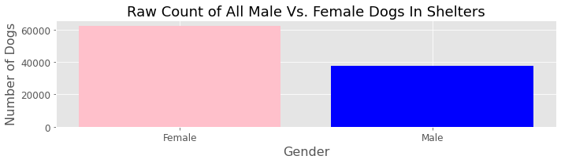

# Dogs In Shelters
### Are there *really* more female dogs in animal rescue shelters than male dogs?

## Data science application: Hypothesis Testing--> 
### Ho : There are 50% female dogs in shelters.  
### Ha : It is not the case that there are 50% female dogs in shelters.  

#### Statistic:  A binomial test using stats.binom.

Our goal is to ascertain whethere there is a statistically significant difference betwee female vs male dog populations in animal rescue shelters. 

Conclusion: Because p != alpha, we fail to reject the null hypothesis and determine there are not 50% female dogs in shelters.  

### Is this the case for *all* subrgroups of dogs?
|| There are more male adult dogs in shelters.|
|-|-|

## Adjusted Project Focus Is On Adult Male Dogs

## Web Scraping for Data Collection
The data was collected using <a href="https://github.com/elsaVelazquez/faster-pet-adoption/blob/master/src/json_data_cleaning.py>OS-level Curl command line prompt </a>, written in python, that sped up the collection of 200,000 records from PetFinder's public API to less than 1 minute.|
  |-|-|

## Next steps --> IMG Classification Using ML <a href="https://scikit-learn.org/stable/datasets/index.html>Scikit-Learn</a>
  
#### The next question:  Is an animal's online presence a predictor of its adoptability? 

Does the pose of a dog influence how fast it gets adopted from a rescue shelter?

By classifying animal shelter data using image processing and tracing an animal's dates of arrival and departure from a shelter, it can be decided if we should fail to reject the null hypothesis and determine that pets are too adorable to be left, no matter how they pose for the cameera.  
In the following image, it is clear to see the image classification categories, as pets are either:
- Standing
- Sitting
- Laying
- Clothed

## My Motivation
| Ghandi |  |  |
*https://www.goodreads.com/quotes/340-the-greatness-of-a-nation-and-its-moral-progress-can*

|-|-|-|
>I am passionate about this project because I am a disabled veteran, and 
>my dog saved my life.  
>Surely more dogs can do more, for more vetearns and more people in general, and 
>we can continue to be proud and grateful to this great nation!

## Latest Project Updates
Please find the latest updates on the project <a href="https://trello.com/b/o8vNQDDg/faster-dog-adoptions">Trello</a> board. 
