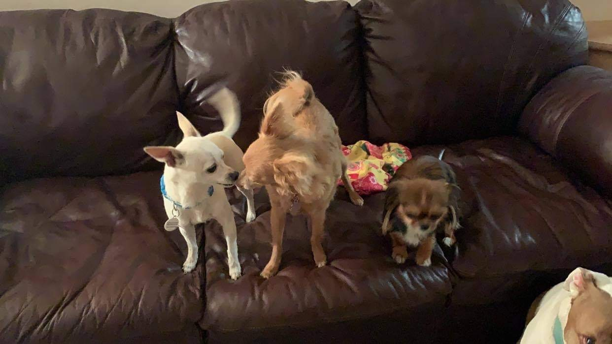

# Faster Pet Adoption

Data science application: analysis of the online presentation factors that influence how fast a pet gets adopted from a rescue shelter.

>“The greatness of a nation and its moral progress can be judged by the way its animals are treated.”

― Mahatma Gandhi")

|  | >“The greatness of a nation and its moral progress can be judged by the way its animals are treated.” |  |
|-|-|-|

###### [https://www.goodreads.com/quotes/340-the-greatness-of-a-nation-and-its-moral-progress-can](https://www.goodreads.com/quotes/340-the-greatness-of-a-nation-and-its-moral-progress-can)
