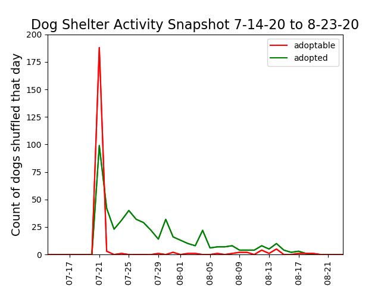

  

# FASTER PET ADOPTION

## HOW CAN A DOG SHELTER MANAGE DOGS' ONLINE PRESENCES TO GET DOGS ADOPTED OUT FASTER?
 

## Using a Naive Bayes Classification System to Predict Image Classification  
A Supervised Learning ML Project by Elsa Velazquez, MEd 
 

>Ho:  Naive Bayes Image Classifier will have >= 90% accuracy in predicting which dogs 
are adopted.  
Ha: Naive Bayes Image Classifier will 
have < 90% accuracy in predicting which dogs are adopted.  

* ### Spoiler alert for the busy: 

* Using a random state to ensure the model results can be replicated with 25% of data as the test set, the Naive Bayes Image Classifier performed at 63.8% accuracy on image classification, and we therefore reject our null hypothesis.  
* A text description
of the dog appears to be more telling
of the dog's future than its pictures, and we
therefore reject our null hypothesies. 

*Note that the data described here only captures a specific window in time that was deeply affected by the Covid global pandemic and the reissuance of global lockdowns.* 
The following figure shows the time series for which this data was taken and the activity that week at dog shelters.  Due to the nature of the PetFinder API, it was not possible to legally scrape for data before this time period and the databases are such that length of stays is overwritten when the dog status changes.
>The dataset includes 500 adopted dogs and 271 adoptable dogs.

 

## *Why a multinomial naive bayes:*
 
The multinomial Naive Bayes classifier is suitable for classification with discrete features (ex: pre-selected categories, word counts for text classification). 

This result is only a bit better than random chance, 
and the average colored images (shown below) show that
this problem would be a more difficult problem to classify.  Possibly, a more sophisticated ML algorithm could predict with a higher accuracy rate. The images below are a comparison of the average adopted and adoptable dog images.  

|Average Adopted Image  | Average Adoptable Image |
|-|-|

 
# The following are examples of misclassified images:
## False Positive Misclassification
 Naive Bayes predicted adopted when the dog's status was adoptable (it was still avaiable):
 
 
 
 
 
 

 

 

## False Negative Misclassifications
Naive Bayes predicted adoptable though the dog was already adopted:

| |
 |
|
|-|-|-|

## PCA 
PCA further supports the decision to abandon a Naive Bayes Image Classification Investigation because it did not help with data analysis, classification, or visualization to simply and interpret the multiviariate data.  
> Ho: PCA will provide <= 4 features that will improve classification by increasing prediction accuracy.  
>Ha: PCA will not provide <= 4 features that will improve classification by increasing prediction accuracy.  

The following tables shows, in red, the data that would be discarded by applying PCA.

In the following figure, it is evident there is no gain from reducing dimensionality from 1024 features (a flattened 32*32 pixel  colored image) to 2-dimensional space because there is no clustering as a result.  The same results were found when running PCA on 2, 4, 6 and 10 principal components.  
 
>*note: Column 2, i.e. the third column vector of the flattened images, had the least std deviation 
so was a likely candidate to show the most
average scenario, but otherwise random feature (i.e. column) selection did not appear to have an impact.*

 
 We therefore reject our null hypothesis because we did not find <= 4 features to help understand the data. 
 

## Logistic Regression
Logistic Regression, Two Tail
Ho: The slope will be zero.  
Ha: The slope will be < zero <. 

Logistic Regression also shows that there 
is not a best fitting line that could answer 
the classification question using image data. 
This scikit learn module is ideal 
because the labels (adopted=1, adoptable=0)
are discrete.
It appears the data shows all the dogs will be adopted. 
 
>The original data is compared side by side with the Logistic Regression of the image data. 

|||
|-|-|

 

# Why not an SVM
A preliminary quest to use a random forest model, applied with cross validation and 5 folds, showed to also do no better than random chance. 

 
# VIF
Due to the continued dead ends in understanding the dog's online presence using image classification, the direction of the investigation lead to a text analysis and VIF was used to determine which features to keep, as they did not have strong multicollinearity.  It was determined that the strongest predictive factor was the manually input description.   

 

# Text Analysis to Predict Dog's Adopted Status

## Bag of Words Cosine DIstance and TF-IDF
When text was analyzed using Naive Bayes on manually input dog descriptions, the prediction performance improved significantly, but we were still not able to fail to reject our null hypothesis.
>Ho: Naive Bayes Text Classification will predict adoption status of adopted with >= 90% accuracy.  
>Ha: Naive Bayes Text Classification will predict adoption status of adopted with < 90% accuracy. 
 

We reject the null hypothesis because Naive Bayes text analysis on dog descriptions had an accuracy rate of 70% despite rates of test and training data splits. 

Using TF-IDF and cosine distances failed to provide insight into which words made the dog's adoption status predictable.  The words "playful" and "heartworm" appeared in Word Clouds but did not have an impact when investigated further.  

|Word Cloud of Adopted Dog Descriptions |Word Cloud of Adoptable Dog Descriptions |
|-|-|

Adoptable with Playful:
people	peopl	peopl	people
prepare	prepar	prepar	prepare
End of stemming and lemmatization
COSINE DISTANCE:  0.922

Adoptable without Playful
people	peopl	peopl	people
prepare	prepar	prepar	prepare
End of stemming and lemmatization
COSINE DISTANCE:  0.922

Adopted with Playful:
probably	probabl	probabl	probably
lbs	lb	lbs	lb
complete	complet	complet	complete
End of stemming and lemmatization
COSINE DISTANCE:  0.953

Adopted without Playful:
probably	probabl	probabl	probably
lbs	lb	lbs	lb
complete	complet	complet	complete
End of stemming and lemmatization
COSINE DISTANCE:  0.953

Entire dataset without and without Playful Identical Results
probably	probabl	probabl	probably
lbs	lb	lbs	lb
complete	complet	complet	complete
End of stemming and lemmatization
COSINE DISTANCE:  0.954

Heartworm also yielded no difference in results.

 

## Comparison of Words in Adopted Vs. Adopted
The following images show the top description words used, collectively, for adopted dogs, and for adoptable dogs.  Note that the word 'None' is a placeholder in the adoptable dogs' descriptions that was left blank in the dog's description.   
 
### Word Counts of Dog Descriptions
||||
|-|-|-|
 

## NEXT STEPS
## Image Classification as a Predictor of Dog Adoption Status
A CNN will be employed to determine if there is signal to capture. 
## Text As a Predictor of Dog Status
Text analysies will be used to determine if leaving the description blank has a correlation to adoptable status, or if there is a general sentiment that is visible in the adopted dogs' descriptions.

## DATA PIPELINE
The data was acquired using an automated script that ran a curl command to scrape the API using an authentication key.  Only 1K API calls are allowed per 24 hour period, with a download limit of 50K.  This lead to only being able to access 1K records per ID per day.
 
From there data was further skimmed down to only include dog data. The data were cleaned through string manipulation, as dataframes, and pushed into CSV format for ease of use.  A unit test was used to determine if the corpus for IF-IDF was correctly processing in all lowercase.   
The images were acquired using an automated Beautiful Soup 4 Script.
 
The majority of the automated pipeline can be seen in main.py.

## Sidenotes regarding this project

* The code is not PEP8 compliant, but it *is* readable by the author, whom is dyslexic. 
*  All animal species in shelters were represented by the API call JSON responses, 
including cats and mares, but the focus for this project
is on dogs. 
* This is the first pandemic in known history where dogs are not scapegoated as carriers, thanks to advances in science, so are subsequently in high demand. 
* In other countries, people have started renting out their dogs as companions during the Covid pandemic.  

---
title: Habits
author: John Doe
date: March 22, 2005
output: html_document
---

---
title: "Habits"
output:
  html_document:
    toc: true
    toc_float: true
---

## Quarterly Results {.tabset}

### By Product

(tab content)

### By Region

(tab content)

---
title: "Habits"
output:
  html_document:
    theme: united
    highlight: tango
---

---
title: "A Shiny Document"
output: html_document
runtime: shiny
---

Workflow:
Data Ingestion
had to figure out how to get out the data i wanted using their whack API
    ended up making a Python  cron job
    
    You will have to open the file creds_temp.txt ('src/pipelines/data_ingestion/cron/creds_temp.txt'), copy and paste your API key, given by PetFinders.com, rename the file as creds.txt and save it in that same directory, for the ingestion pipeline to be automated for you.  

Clean the Data
    Data Structures Conversions-- turned all the JSON into csv with a python function

Data Wrangling/Munging
I used an AWS S3 bucket to store the data and interacted with it using PySpark.
I created a keypair using EC2.

I would have lost about 18% of the data if I had dropped all NaNs.  Because many of the NaNs were simply descriptions that were not filled out, I replaced those rows with the string "DUMMY_TEXT".  

## Initial Schema

root
 |-- _links: struct (nullable = true)
 |    |-- organization: struct (nullable = true)
 |    |    |-- href: string (nullable = true)
 |    |-- self: struct (nullable = true)
 |    |    |-- href: string (nullable = true)
 |    |-- type: struct (nullable = true)
 |    |    |-- href: string (nullable = true)
 |-- age: string (nullable = true)
 |-- attributes: struct (nullable = true)
 |    |-- declawed: boolean (nullable = true)
 |    |-- house_trained: boolean (nullable = true)
 |    |-- shots_current: boolean (nullable = true)
 |    |-- spayed_neutered: boolean (nullable = true)
 |    |-- special_needs: boolean (nullable = true)
 |-- breeds: struct (nullable = true)
 |    |-- mixed: boolean (nullable = true)
 |    |-- primary: string (nullable = true)
 |    |-- secondary: string (nullable = true)
 |    |-- unknown: boolean (nullable = true)
 |-- coat: string (nullable = true)
 |-- colors: struct (nullable = true)
 |    |-- primary: string (nullable = true)
 |    |-- secondary: string (nullable = true)
 |    |-- tertiary: string (nullable = true)
 |-- contact: struct (nullable = true)
 |    |-- address: struct (nullable = true)
 |    |    |-- address1: string (nullable = true)
 |    |    |-- address2: string (nullable = true)
 |    |    |-- city: string (nullable = true)
 |    |    |-- country: string (nullable = true)
 |    |    |-- postcode: string (nullable = true)
 |    |    |-- state: string (nullable = true)
 |    |-- email: string (nullable = true)
 |    |-- phone: string (nullable = true)
 |-- description: string (nullable = true)
 |-- distance: string (nullable = true)
 |-- environment: struct (nullable = true)
 |    |-- cats: boolean (nullable = true)
 |    |-- children: boolean (nullable = true)
 |    |-- dogs: boolean (nullable = true)
 |-- gender: string (nullable = true)
 |-- id: long (nullable = true)
 |-- name: string (nullable = true)
 |-- organization_animal_id: string (nullable = true)
 |-- organization_id: string (nullable = true)
 |-- photos: array (nullable = true)
 |    |-- element: struct (containsNull = true)
 |    |    |-- full: string (nullable = true)
 |    |    |-- large: string (nullable = true)
 |    |    |-- medium: string (nullable = true)
 |    |    |-- small: string (nullable = true)
 |-- primary_photo_cropped: struct (nullable = true)
 |    |-- full: string (nullable = true)
 |    |-- large: string (nullable = true)
 |    |-- medium: string (nullable = true)
 |    |-- small: string (nullable = true)
 |-- published_at: string (nullable = true)
 |-- size: string (nullable = true)
 |-- species: string (nullable = true)
 |-- status: string (nullable = true)
 |-- status_changed_at: string (nullable = true)
 |-- tags: array (nullable = true)
 |    |-- element: string (containsNull = true)
 |-- type: string (nullable = true)
 |-- url: string (nullable = true)
 |-- videos: array (nullable = true)
 |    |-- element: struct (containsNull = true)
 |    |    |-- embed: string (nullable = true)

## Reduced Schema
df_breed = df.select('id', 'age', 'gender', 'breeds', 'description', 'status', 'photos', 'status_changed_at')

root
 |-- id: long (nullable = true)
 |-- age: string (nullable = true)
 |-- gender: string (nullable = true)
 |-- breeds: struct (nullable = true)
 |    |-- mixed: boolean (nullable = true)
 |    |-- primary: string (nullable = true)
 |    |-- secondary: string (nullable = true)
 |    |-- unknown: boolean (nullable = true)
 |-- description: string (nullable = true)
 |-- status: string (nullable = true)
 |-- photos: array (nullable = true)
 |    |-- element: struct (containsNull = true)
 |    |    |-- full: string (nullable = true)
 |    |    |-- large: string (nullable = true)
 |    |    |-- medium: string (nullable = true)
 |    |    |-- small: string (nullable = true)
 |-- status_changed_at: string (nullable = true)
 |-- species: string (nullable = true)
 
 
 

## After Inserting Dummy Data Certain Fields

+--------+-----+------+--------------------+--------------------+-------+--------------------+--------------------+
|      id|  age|gender|              breeds|         description| status|              photos|   status_changed_at|
+--------+-----+------+--------------------+--------------------+-------+--------------------+--------------------+
|48734452|Adult|  Male|[true, Chihuahua,...|Dexter is a cute ...|adopted|                  []|2020-08-10T03:39:...|
|48734448|Young|  Male|[false, Tabby,, f...|          DUMMY_TEXT|adopted|                  []|2020-08-10T03:38:...|
|48734449|Young|Female|[false, Domestic ...|          DUMMY_TEXT|adopted|                  []|2020-08-10T03:38:...|
|48734431|Young|Female|[false, Great Dan...|You can fill out ...|adopted|[[https://dl5zpyw...|2020-08-10T03:23:...|
|48734430| Baby|  Male|[true, Domestic S...|HUBBLE is a super...|adopted|[[https://dl5zpyw...|2020-08-10T03:22:...|
|48734406|Young|Female|[true, Domestic S...|Hi. I&amp;#39;m M...|adopted|[[https://dl5zpyw...|2020-08-10T03:08:...|
|48734405|Young|  Male|[true, Domestic S...|Ross is a very sw...|adopted|[[https://dl5zpyw...|2020-08-10T03:08:...|
|48734398| Baby|  Male|[true, Shepherd, ...|6 week old male, ...|adopted|[[https://dl5zpyw...|2020-08-10T03:07:...|
|48734397| Baby|  Male|[true, Shepherd, ...|6 week old male, ...|adopted|[[https://dl5zpyw...|2020-08-10T03:07:...|
|48734390| Baby|  Male|[false, Domestic ...|          DUMMY_TEXT|adopted|                  []|2020-08-10T03:06:...|
|48734391| Baby|Female|[false, Domestic ...|          DUMMY_TEXT|adopted|                  []|2020-08-10T03:06:...|
|48734361|Young|  Male|[false, Domestic ...|You can fill out ...|adopted|[[https://dl5zpyw...|2020-08-10T02:54:...|
|48734360|Young|Female|[true, Domestic S...|          DUMMY_TEXT|adopted|                  []|2020-08-10T02:53:...|
|48734359|Young|  Male|[true, Domestic S...|Will looks just l...|adopted|[[https://dl5zpyw...|2020-08-10T02:53:...|
|48734356|Adult|Female|[true, Australian...|          DUMMY_TEXT|adopted|[[https://dl5zpyw...|2020-08-10T02:53:...|
|48734355|Young|Female|[true, Husky, Cat...|Dakota is a lovel...|adopted|[[https://dl5zpyw...|2020-08-10T02:53:...|
|48734309|Young|  Male|[true, Domestic S...|Wendall is just a...|adopted|[[https://dl5zpyw...|2020-08-10T02:38:...|
|48734298|Adult|Female|[true, Chihuahua,...|You can fill out ...|adopted|[[https://dl5zpyw...|2020-08-10T02:35:...|
|48734268| Baby|  Male|[false, Domestic ...|Adopt Butters!
Bu...|adopted|[[https://dl5zpyw...|2020-08-10T02:25:...|
|48734244| Baby|  Male|[true, Hound, Bla...|Steve is a 10 mon...|adopted|[[https://dl5zpyw...|2020-08-10T02:22:...|
+--------+-----+------+--------------------+--------------------+-------+--------------------+--------------------+

EDA
+------+--------------------+-----+-------+-------+------+
|gender|              breeds|  age| status|species|Number|
+------+--------------------+-----+-------+-------+------+
|  Male|[true, Domestic S...| Baby|adopted|    Cat|    37|
|  Male|[true, Terrier, C...|Young|adopted|    Dog|    30|
|  Male|[false, Domestic ...| Baby|adopted|    Cat|    28|
|Female|[true, Domestic S...| Baby|adopted|    Cat|    22|
|  Male|[true, Labrador R...|Young|adopted|    Dog|    20|
|  Male|[false, Domestic ...|Young|adopted|    Cat|    18|
|Female|[true, Chihuahua,...|Young|adopted|    Dog|    17|
|  Male|[true, Domestic S...|Young|adopted|    Cat|    17|
|Female|[false, Domestic ...| Baby|adopted|    Cat|    17|
|Female|[true, Poodle,, f...|Young|adopted|    Dog|    16|
|Female|[true, Shepherd,,...|Young|adopted|    Dog|    15|
|Female|[true, Siamese,, ...| Baby|adopted|    Cat|    15|
|  Male|[true, Siamese,, ...| Baby|adopted|    Cat|    14|
|  Male|[false, Domestic ...|Adult|adopted|    Cat|    13|
|  Male|[true, Pit Bull T...| Baby|adopted|    Dog|    12|
|  Male|[true, German She...| Baby|adopted|    Dog|    11|
|  Male|[true, Yorkshire ...|Young|adopted|    Dog|    10|
|Female|[true, Maltese, P...|Young|adopted|    Dog|    10|
|Female|[false, Husky,, f...|Young|adopted|    Dog|    10|
|Female|[true, Jack Russe...|Adult|adopted|    Dog|     9|
+------+--------------------+-----+-------+-------+------+
compare ratio of male and female dogs in shelters to ratios of adopted genders

compare by age groups

do a time series to see if there is any truth to covid driven adoption spikes- trends and seasons?
Can I predict when more dogs will be adopted?
When more will go to shelters?

Yes, there was truth to the "Dog Demand Due to Covid" stories. 
https://www.washingtonpost.com/nation/2020/08/12/adoptions-dogs-coronavirus/
It appears so many people were desperate for dogs, the surge could possibly be explained by the raise in demand, first, then a purpoesful question 
to find the supply by the shelters.  Per the news article, the data seems legitamite that as soon as they come in, 
the doggoes are finding forever homes.  

https://www.washingtonpost.com/graphics/2020/lifestyle/dogs-loneliness-coronavirus/
This is the first time dogs are having a good pandemic, namely because science allowed us to track the 
"real carriers" more quickly (parents, hide your children!). 

India has declared the feeding of street dogs, who lost food sources when restaurants and street vendors shut down, an essential service.

In March and April, when much of Europe was under total lockdown, one of the few permissible reasons to leave one’s house was to exercise a four-legged friend. People offered their dogs for rent on social media. One man in northern Spain was caught dragging a stuffed toy on a leash, and another disguised his daughter as a Dalmatian to get out of his apartment. A mayor on the Italian island of Sardinia felt compelled to offer the clarification that to qualify for a walk, the dog “must be alive.”

find 1-3 features to really look into now that I have the data on adopted dogs
VIF results

Regression - Lasso and Elastic Net-- predicting a quantity of dogs

Clustering-- because number of categories is known, < 10K samples so can use KMeans (could have also bootstrapped)

Compare word clouds of adopted vs adoptable
so which words are having more impact?
having "playful" - in adopted
or having "under treatment"/ "heartworm positive" - in adoptable

UNIQUE WORDS IN DESCRIPTION:
ADOPTABLE:
The number of words in the description is 179.
The number of unique words in the description is 127.
The unique words are:  {"friendly',", "Fences',", "girl',", "'intelligent',", "'Crate", "'Neutered',", "['Sweet", "'fostered']", 'for', "'Sweet',", 'treatment', "Kids',", "'loving']", 'the', 'well', "'Dog", "['Good", "['Dog", "'Owner", 'older', 'in', "'sweet',", 'Free', "Leash']", "Play',", "'Likes", 'Children', 'editing', "['stunning", 'Dog', "'bio", "room',", "'Energetic',", "Cats',", "['Playful']", "'People", "['Shy',", "trained',", "'Good", "'adorable']", "'Cuddler',", 'call', 'Well', "'Moderate", "Cats']", "['lap", 'positive', "Training',", "Preferred',", "'Shy", "'Outgoing',", 'NOT', 'children', 'like', "['happy',", "['loving',", "['Loving',", "'Needs", "Jumper',", "'Gentle']", "positive',", "'Friendly',", "['Smart',", "'Older", 'twelve', "'Smart']", "'Snuggler']", "'Forgiving',", "'Sweet']", 'Home', 'canned', "dog']", "cats',", "'Single", 'a', "Jumper']", "['Fence", 'dog', "car',", 'new', 'shelter', "['Does", "timid']", "girl']", "'cute',", 'On', "'No", "Home',", "'Heartworm", "Motivated',", "'Food", "'Spayed',", "['Adult", "['Playful',", 'on', "'Microchipped',", 'Only', "Positive']", 'more', "dogs',", "'Loving',", "Friendly',", "leash']", "['Friendly',", 'under', "Energy',", 'other', 'A', "food',", "People']", "Preferred']", "'Loves", "'Plays", "Home']", "'Shy',", "Experience',", "['Heartworm", "'']", "Trained',", "info',", "['Cat", 'with', "'active',", "'Jumps", "'Walks", "'House", "'Potty"}   ADOPTED:
                                                                                                                                                                                                                                                                                                                                                                                                                                                                                                                                                                                                                                                                                                                                                                                                                                                                                                                                                                                                                                                                                                                                                                                                                                                                                   
                                                                                                                                                                                                                                                                                                                                                                                                                                                                                                                                                                                                                                                                                                                                                                                                                                                                                                                                                                                                                                                                                                                                                                                                                                                                                                                                                                                                            
                                                                                                                                                                                                                                                                                                                                                                                                                                                                                                                                                                                                                                                                                                                                                                                                                                                                                                                                                                                                                                                                                                                                                                                                                                                                                                                                                                                                            
                                                                                                                                                                                                                                                                                                                                                                                                                                                                                                                                                                                                                                                                                                                                                                                                                                                                                                                                                                                                                                                                                                                                                                                                                                                                                                                                                                         
                                                                                                                                                                                                                                                                                                                                                                                                                                                                                                                                                                                                                                                                                                                                                                                                                                                                                                                                                                                                                                                                                                                                                                                                                                                                                                                                                                                     
                                                                                                                                                                                                                                                                                                                                                                                                                                                                                                                                                                                                                                                                                                                                                                                                                                                                                                                                                                                                                                                                                                                                                                                                                                                                                                                                                                                     

https://www.finex.co/how-to-display-html-in-github/
Displaying HTML Files in GitHub
Setting up an HTML page in GitHub is not difficult but it is a bit lengthy. Just follow these steps.

Create the HTML from your RMarkdown document and save to your local directory.
Create a new repo, or go to an existing repo, in your GitHub.
In the repo, create a new file called docs/index.html.
In the index.html file, type this code: <html><body>
Hello World
</body></html>
Commit the file.
In the repo, click on the Settings tab.
Scroll down to GitHub Pages Section.
Under “Source”, choose “master branch/docs folder” and save. If that doesn’t work, try the “master branch” and save.
A message will appear that your site is read to be published. Click on the link.
When Git finds the index.html file in a docs/ folder, it creates a web address for the contents. The address takes the form: http://username.github.io/repository
Go to that address. You should see your “Hello World” greeting. That is your index.html file.
Go back to the docs/ folder and open it.
Upload the HTML file you created in RMarkdown and commit.
Return to your github.io site but add the HTML file name to the address: http://username.github.io/repository/filename.html.
You should find your HTML posted there.

For a deeper explanation of Naive Bayes Multinomial, please visit <a href="https://en.wikipedia.org/wiki/Naive_Bayes_classifier#Multinomial_na%C3%AFve_Bayes">https://en.wikipedia.org/wiki/Naive_Bayes_classifier#Multinomial_na%C3%AFve_Bayes</a>
