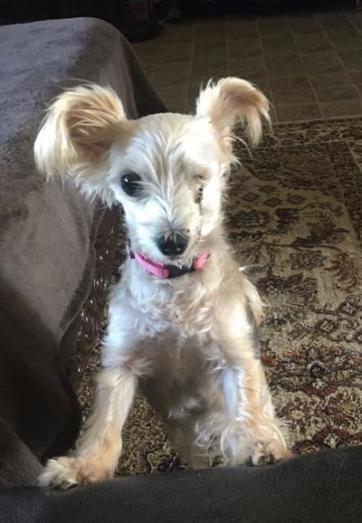
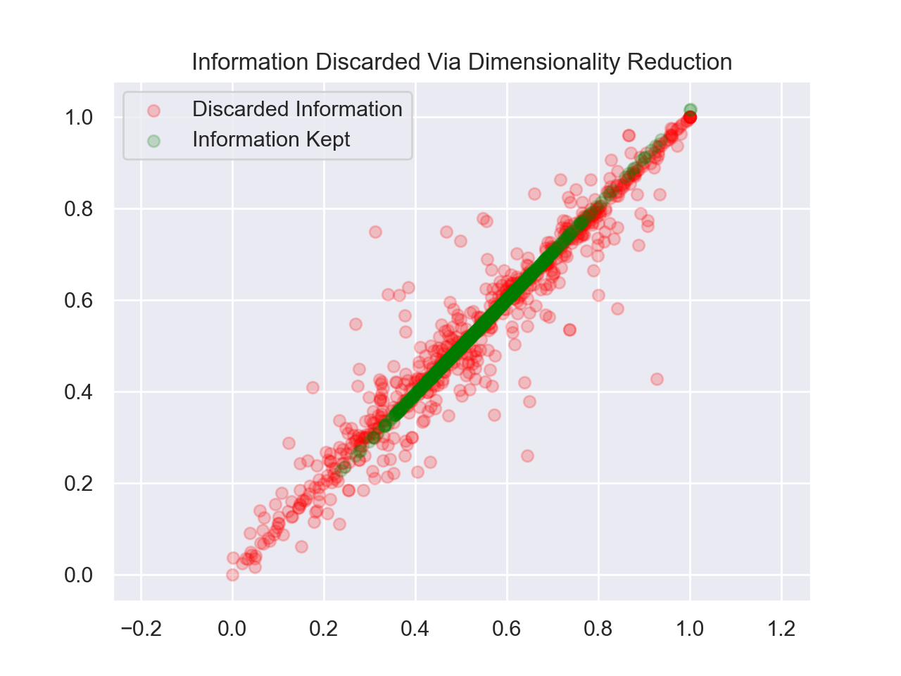
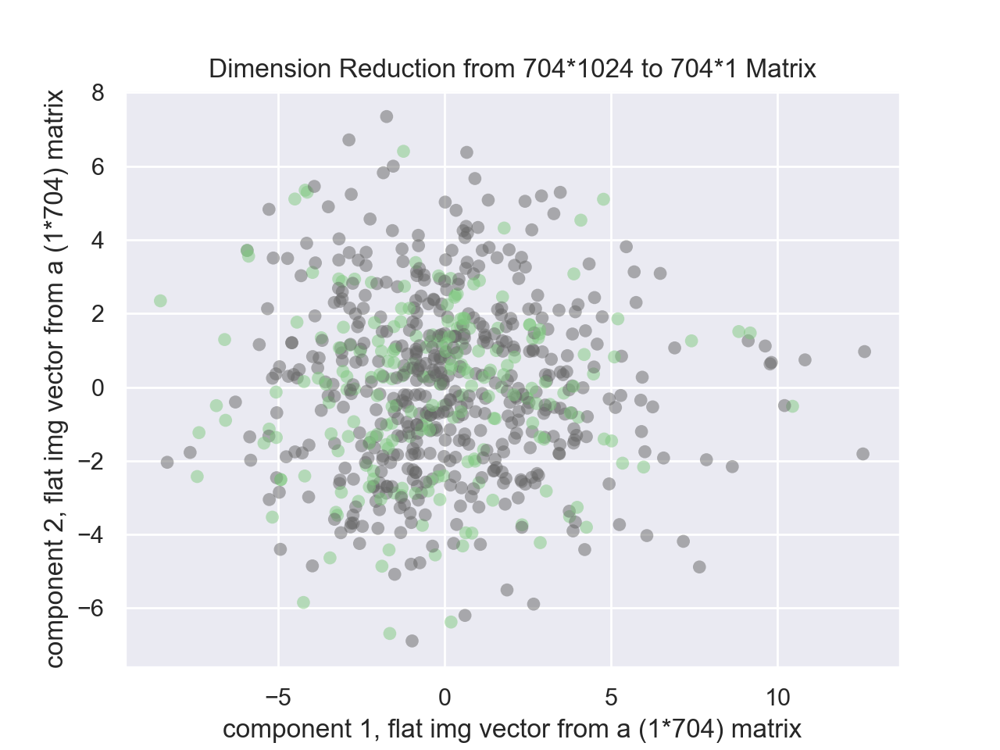

---

## FASTER PET ADOPTION
### HOW CAN A DOG SHELTER MANAGE DOGS' ONLINE PRESENCES TO GET DOGS ADOPTED OUT FASTER?

### Using a Multinomial Naive Bayes Classification System to Predict on Images and 

A Supervised Learning ML Project by Elsa Velazquez, MEd, Data Scientist, Software Engineer 
LinkedIn: <a href="https://www.linkedin.com/in/elsa-velazquez-020bb9175/"> https://www.linkedin.com/in/elsa-velazquez-020bb9175/ </a>

---  

>Ho:  Naive Bayes Image Classifier will have >= 90% accuracy in predicting which dogs 
are adopted.  
Ha: Naive Bayes Image Classifier will 
have < 90% accuracy in predicting which dogs are adopted.  

* ### Spoiler alert for the busy: 

* Using a random state to ensure the model results can be replicated with 25% of data as the test set, the Naive Bayes Image Classifier performed at 63.8% accuracy on image classification, and we therefore reject our null hypothesis.  
* A text description
of the dog appears to be more telling
of the dog's future than its pictures, and we
therefore reject our null hypothesies. 

*Note that the data described here only captures a specific window in time that was deeply affected by the Covid global pandemic and the reissuance of global lockdowns.* 
The following figure shows the time series for which this data was taken and the activity that week at dog shelters.  Due to the nature of the PetFinder API, it was not possible to legally scrape for data before this time period and the databases are such that length of stays is overwritten when the dog status changes.
>The dataset includes 527 adopted dogs and 227 adoptable dogs.

 

## *Why a multinomial naive bayes:*
 
The multinomial Naive Bayes classifier is suitable for classification with discrete features (ex: pre-selected categories, word counts for text classification). 

This result is only a bit better than random chance, 
and the average colored images (shown below) show that
this problem would be a more difficult problem to classify.  Possibly, a more sophisticated ML algorithm could predict with a higher accuracy rate. The images below are a comparison of the average adopted and adoptable dog images.  

|Average Adopted Image  | Average Adoptable Image |
|-|-|

 

# The following are examples of misclassified images:
## False Positive Misclassification
 Naive Bayes predicted adopted when the dog's status was adoptable (it was still avaiable):
 
| | | || ||||
|-|-|-|-|-|-|-|-|

 

## False Negative Misclassifications
Naive Bayes predicted adoptable though the dog was already adopted:
 

||||
|-|-|-|

## PCA 
PCA further supports the decision to abandon a Naive Bayes Image Classification Investigation because it did not help with data analysis, classification, or visualization to simply and interpret the multiviariate data.  
> Ho: PCA will provide <= 4 features that will improve classification by increasing prediction accuracy.  
>Ha: PCA will not provide <= 4 features that will improve classification by increasing prediction accuracy.  

The following tables shows, in red, the data that would be discarded by applying PCA.

In the following figure, it is evident there is no gain from reducing dimensionality from 1024 features (a flattened 32*32 pixel  colored image) to 2-dimensional space because there is no clustering as a result.  The same results were found when running PCA on 2, 4, 6 and 10 principal components.  
 
>*note: Column 2, i.e. the third column vector of the flattened images, had the least std deviation 
so was a likely candidate to show the most
average scenario, but otherwise random feature (i.e. column) selection did not appear to have an impact.*

 
 We therefore reject our null hypothesis because we did not find <= 4 features to help understand the data. 
 

## Logistic Regression
Logistic Regression, Two Tail
 
Ho: The slope will be zero.  
Ha: The slope will be < zero <. 

Logistic Regression also shows that there 
is not a best fitting line that could answer 
the classification question using image data. 
This scikit learn module is ideal 
because the labels (adopted=1, adoptable=0)
are discrete.
It appears the data shows all the dogs will be adopted. 
 
>The original data is compared side by side with the Logistic Regression of the image data. 

|||
|-|-|

 

# Why not an SVM
A preliminary quest to use a random forest model, applied with cross validation and 5 folds, showed to also do no better than random chance. 

 
# VIF
Due to the continued dead ends in understanding the dog's online presence using image classification, the direction of the investigation lead to a text analysis and VIF was used to determine which features to keep, as they did not have strong multicollinearity.  It was determined that the strongest predictive factor was the manually input description.   

 

# Text Analysis to Predict Dog's Adopted Status

## Bag of Words Cosine DIstance and TF-IDF
When text was analyzed using Naive Bayes on manually input dog descriptions, the prediction performance improved significantly, but we were still not able to fail to reject our null hypothesis.
>Ho: Naive Bayes Text Classification will predict adoption status of adopted with >= 90% accuracy.  
>Ha: Naive Bayes Text Classification will predict adoption status of adopted with < 90% accuracy. 
 

We reject the null hypothesis because Naive Bayes text analysis on dog descriptions had an accuracy rate of 70% despite rates of test and training data splits. 

Using TF-IDF and cosine distances failed to provide insight into which words made the dog's adoption status predictable.  The words "playful" and "heartworm" appeared in Word Clouds but did not have an impact when investigated further.  

|Word Cloud of Adopted Dog Descriptions |Word Cloud of Adoptable Dog Descriptions |
|-|-|

 

## Comparisons of Cosine Distances
There were no differences in cosine distances with any combinations of including and not including the words "playful" or "heartworm."
 

Adoptable : 
>* Stemming and Lemmitization: 
people	peopl	peopl	people 
prepare	prepar	prepar	prepare 
>* COSINE DISTANCE same for both:  0.922 

 
Adopted: 

>* Stemming and Lemmitization: 
probably	probabl	probabl	probably 
lbs	lb	lbs	lb 
complete	complet	complet	complete 
>* COSINE DISTANCE same for both:  0.953 

 
Entire dataset with and without "playful": 

>* Stemming and Lemmitization: 
probably	probabl	probabl	probably 
lbs	lb	lbs	lb 
complete	complet	complet	complete 
>* COSINE DISTANCE same for both:  0.954
 
 
## Comparison of Words in Entire Dataset Vs. Adopted Vs. Adoptable
The following images show the top description words used, collectively, for adopted dogs, and for adoptable dogs.  Note that the word 'None' is a placeholder in the adoptable dogs' descriptions that was left blank in the dog's description.   
 
### Word Counts of Dog Descriptions 
Top 25 Words Less Stopwords
||||
|-|-|-|
 

## NEXT STEPS
## Image Classification as a Predictor of Dog Adoption Status
A CNN will be employed to determine if there is signal to capture. 
## Text As a Predictor of Dog Status
Text analysies will be used to determine if leaving the description blank has a correlation to adoptable status, or if there is a general sentiment that is visible in the adopted dogs' descriptions.

## DATA PIPELINE
The data was acquired using an automated script that ran a curl command to scrape the API using an authentication key (<a href="src/pipelines/data_ingestion/cron/get_api_token.py">get_api_token.py</a>).  Only 1K API calls are allowed per 24 hour period, with a download limit of 50K.  This lead to only being able to access 1K records per ID per day (<a href="src/pipelines/data_ingestion/cron/scrape_by_animal_id.py">scrape_by_animal_id.py</a>).
 
From there data was further skimmed down to only include dog data ( <a href="src/pipelines/cleaning/delete_invalid_json_files.py"> delete_invalid_json_files.py</a>). The data were cleaned through string manipulation, as dataframes, and pushed into CSV format for ease of use (<a href="https://raw.githubusercontent.com/elsaVelazquez/faster-pet-adoption/master/data/csv/giant_valid_csv.csv">raw json</a>).  A <a href="test/unit_tests/test_strings_are_lowercase.py">unit test </a>was used to determine if the corpuses for IF-IDF was correctly processing in all lowercase.   
The images were acquired using an automated Beautiful Soup 4 Script.
 
The majority of the automated pipeline can be seen in <a href="src/main.py">main.py</a>.
 

## Sidenotes regarding this project

* The code is not PEP8 compliant, but it *is* readable by the author, whom is dyslexic and with other visual and cognitive impairments. 
*  All animal species in shelters were represented by the API call JSON responses, 
including cats and mares, but the focus for this project
is on dogs. 
* This is the first pandemic in known history where dogs are not scapegoated as carriers, thanks to advances in science, so are subsequently in high demand. 
* In other countries, people have started renting out their dogs as companions during the Covid pandemic.  
* India has declared the feeding of street dogs, who lost food sources when restaurants and street vendors shut down, an essential service.

---

For a deeper explanation of Naive Bayes Multinomial, please visit <a href="https://en.wikipedia.org/wiki/Naive_Bayes_classifier#Multinomial_na%C3%AFve_Bayes">https://en.wikipedia.org/wiki/Naive_Bayes_classifier#Multinomial_na%C3%AFve_Bayes</a>

---
FASTER PET ADOPTION 
by Elsa Velazquez, MEd 
Data Scientist, Software Engineer 
August 28, 2020 
LinkedIn: <a href="https://www.linkedin.com/in/elsa-velazquez-020bb9175/"> https://www.linkedin.com/in/elsa-velazquez-020bb9175/ </a>

---